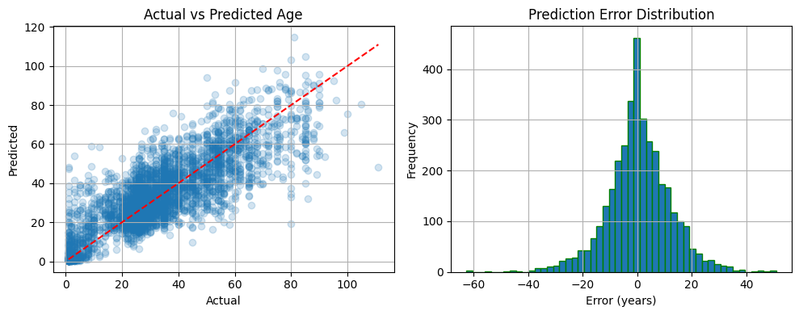
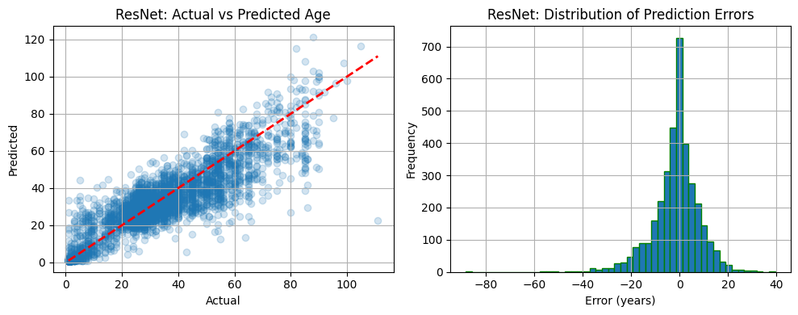
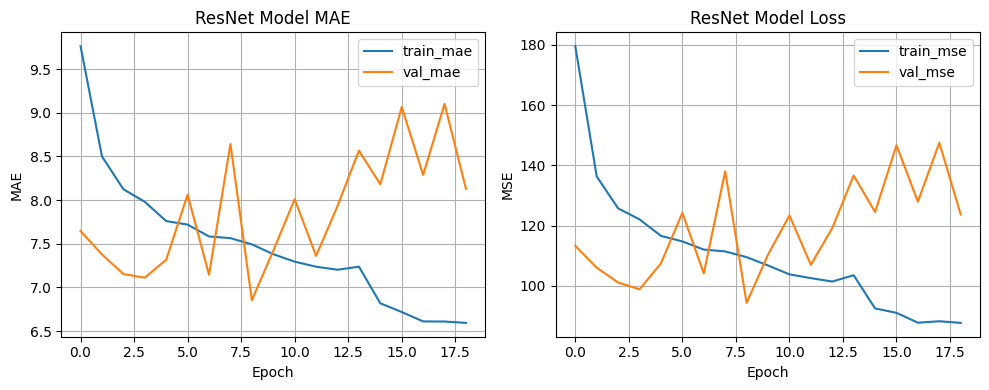

# Deep Learning Age Prediction

This application demonstrates an age prediction model built using deep learning techniques. This app utilizes a ResNet model for age prediction. Explore the different pages in the sidebar to understand the model's performance, and try out live predictions using images from the available dataset or by uploading your own.

## Project Overview

The primary goal of this project is to develop a deep learning model capable of accurately predicting the age of a person from a facial image. This involves several key stages:

1.  **Data Preprocessing:** Utilizing the UTKFace dataset, which contains over 20,000 images, each labeled with age, gender, and ethnicity. The images are preprocessed to be suitable for model training.
2.  **Model Development:** Two different architectures are explored for this task:
    - A custom **Convolutional Neural Network (CNN)** built from scratch.
    - A more complex **Residual Network (ResNet)**, leveraging transfer learning principles.
3.  **Model Evaluation:** The performance of both models is rigorously evaluated using metrics such as Mean Absolute Error (MAE), Mean Squared Error (MSE), and Root Mean Squared Error (RMSE).
4.  **Live Prediction:** The best-performing model (ResNet) is deployed in this interactive web application, allowing users to select an image and see the age prediction in real-time.

This application serves as a comprehensive demonstration of the end-to-end process of building and deploying a deep learning model for a real-world computer vision task.

## Model Performance Overview

The performance of the two models was evaluated on the test set. The ResNet50 model significantly outperforms the custom CNN across all metrics.

| Model    | MAE  | MSE    | RMSE   |
|----------|------|--------|--------|
| CNN      | 8.58 | 136.07 | 11.67  |
| ResNet50 | 6.72 | 93.78  | 9.68   |

### Understanding the Metrics:
- **Mean Absolute Error (MAE):** The average absolute difference between the predicted and actual ages. A lower value is better.
- **Mean Squared Error (MSE):** The average of the squared differences between predicted and actual ages. This metric penalizes larger errors more heavily.
- **Root Mean Squared Error (RMSE):** The square root of the MSE, expressed in the same unit as the target variable (years).

## Comparison and Analysis

The ResNet50 model's superior performance is attributed to transfer learning. By using weights pre-trained on the ImageNet dataset, the model starts with a strong understanding of general image features, which it can then adapt for the specific task of age prediction. The custom CNN, trained from scratch, requires more data and tuning to achieve a similar level of performance.

### Key Findings:
- **Accuracy:** ResNet50 has a lower MAE (6.72 vs 8.58), indicating its predictions are, on average, more accurate.
- **Error Sensitivity:** ResNet50's lower MSE (93.78 vs 136.07) suggests it makes fewer large prediction errors compared to the CNN.
- **Interpretability:** With an RMSE of 9.68 years, the ResNet50 model's predictions are, on average, within approximately 9.68 years of the actual age, which is more reliable than the CNN's 11.67 years.

## Model Training Insights

The training process for both models was monitored to assess learning and prevent overfitting.

### CNN Training
The training and validation loss for the CNN model diverged early in the training process, indicating a tendency to overfit.

### ResNet Training
The ResNet model's training was more stable, although some overfitting is still present, as indicated by the gap between the training and validation loss curves.

### Prediction Behavior
Both models show a tendency to underestimate the age of older individuals, a common issue in age prediction tasks that can be caused by fewer training examples for older age groups. However, the ResNet model's predictions are more tightly clustered around the actual values.

**CNN Predictions**

**ResNet Predictions**

## Built With

*   [Streamlit](https://streamlit.io/) - Web application framework
*   [TensorFlow](https://www.tensorflow.org/) / [Keras](https://keras.io/) - Deep learning framework
*   [Pandas](https://pandas.pydata.org/) - Data manipulation and analysis
*   [NumPy](https://numpy.org/) - Numerical computing
*   [OpenCV](https://opencv.org/) - Computer vision library
*   [Matplotlib](https://matplotlib.org/) - Plotting and visualization
